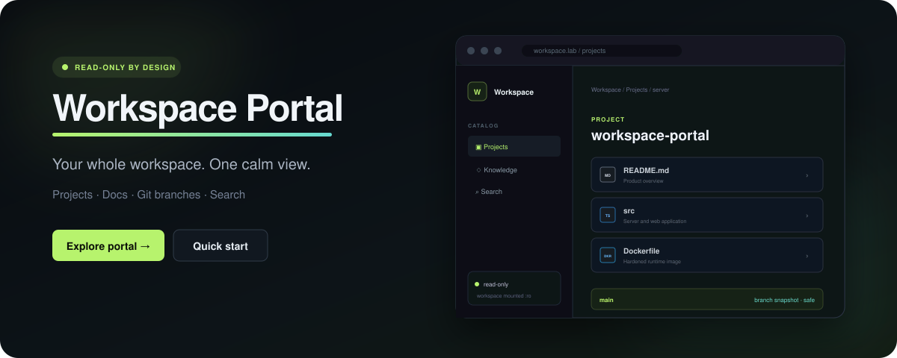

<p align="center">
  <a href="https://agsgimenez.github.io/workspace-portal/">
    
  </a>
</p>

<p align="center">
  <strong>A self-hosted, read-only explorer for projects, Markdown knowledge,<br>local Git repositories and branch snapshots.</strong>
</p>

<p align="center">
  <a href="https://agsgimenez.github.io/workspace-portal/"><strong>Explore the website</strong></a>
  ·
  <a href="#quick-start">Quick start</a>
  ·
  <a href="SECURITY.md">Security model</a>
  ·
  <a href="CONTRIBUTING.md">Contributing</a>
</p>

<p align="center">

[](https://github.com/agsgimenez/workspace-portal/actions/workflows/ci.yml)
[](https://agsgimenez.github.io/workspace-portal/)
[](LICENSE)
[](package.json)
[](package.json)
</p>

---

Workspace Portal turns the folder structure you already use into a focused web
catalog. It renders documentation, understands local Git repositories, links to
web remotes and lets you inspect another local branch without checking it out.
It deliberately does not expose editing, uploads, deletion, a shell or command
execution from the browser.

## Why Workspace Portal?

| Your workspace today | With Workspace Portal |
| --- | --- |
| Projects, repos and notes spread across folders | One curated navigation surface |
| Markdown links that only make sense in an editor | Connected, GitHub-flavored Markdown reading |
| Context switching just to inspect another branch | Read branch snapshots without touching the working tree |
| Broad file browsers that expose too much | Positive root and file-type allowlists |
| A remote IDE when you only wanted visibility | A deliberately read-only explorer |

## What it does

- **Curated workspace navigation** — expose only configured project and
  knowledge roots.
- **Markdown reading** — render GFM safely and preserve relative document links.
- **Git-aware projects** — discover nested repositories, active branches and
  supported web remotes.
- **Branch snapshots** — browse text files from any detected local branch via
  Git objects, without `checkout`.
- **Workspace search** — search visible text with strict result and size limits.
- **File-aware browsing** — recognize common source/config formats and preview
  allowed PDFs, PNG, JPEG and WebP images.
- **Markdown PDF export** — print any visible Markdown or MDX document with a
  paper-specific layout, without writing files on the server.
- **Hardened deployment** — run non-root, drop Linux capabilities and mount the
  workspace read-only.

## Quick start

### Requirements

- Node.js 24+
- pnpm 11.8.0 (the exact version is declared in `package.json`)
- Git

### Local development

```bash
git clone https://github.com/agsgimenez/workspace-portal.git
cd workspace-portal
pnpm install --frozen-lockfile
cp workspace-portal.config.json workspace-portal.local.json
```

Edit `workspace-portal.local.json` so every root exists below your workspace,
then run:

```bash
WORKSPACE_ROOT=/absolute/path/to/workspace \
WORKSPACE_PORTAL_CONFIG=./workspace-portal.local.json \
pnpm dev:server
```

In another terminal:

```bash
pnpm dev:web
```

The UI starts on `http://127.0.0.1:5178` and proxies the API on port `4178`.

### Docker

Create a local `.env` (ignored by Git):

```dotenv
WORKSPACE_ROOT=/absolute/path/to/workspace
WORKSPACE_PORTAL_CONFIG_FILE=./workspace-portal.local.json
```

Then build and run:

```bash
docker compose up -d --build
```

The provided Compose service:

- mounts the workspace and portal configuration read-only;
- runs as UID/GID `10001`;
- drops all Linux capabilities;
- uses a read-only root filesystem and constrained temporary filesystem;
- publishes on loopback and Docker's host gateway for a trusted reverse proxy.

## Configuration

The committed `workspace-portal.config.json` is intentionally generic. Copy it
to `workspace-portal.local.json` and keep machine-specific roots in that ignored
file.

```json
{
  "roots": [
    { "path": "README.md", "label": "Workspace", "kind": "document" },
    { "path": "projects", "label": "Projects", "kind": "projects" },
    { "path": "docs", "label": "Documentation", "kind": "knowledge" }
  ],
  "allowedExtensions": [".md", ".pdf", ".png", ".jpg", ".jpeg", ".webp"],
  "maxFileBytes": 1048576,
  "maxImageBytes": 5242880
}
```

Repository discovery enriches configured project roots, but never expands the
security perimeter.

## Security model

Read-only access can still leak confidential data, so confidentiality is the
primary boundary:

- configured internals, caches and common generated directories are excluded,
  while useful dot-directories such as `.github` remain visible;
- sensitive dot-directories such as `.ssh`, `.aws`, `.kube`, `.docker` and
  secret-like path segments remain denied independently of configuration;
- key stores, databases, environment files and secret-like filenames are
  denied;
- symlinks cannot escape the visible roots;
- branch names must match detected local refs;
- branch reads use fixed Git arguments without a shell and never perform a
  checkout;
- raw preview is limited to allowed PDFs and raster images; PNG, JPEG and WebP
  signatures must match their extensions and images use a separate size limit;
- SVG is intentionally excluded from image preview because it can contain
  active content;
- Markdown HTML is skipped and responses use a strict CSP;
- file sizes, tree entries, search queries and results are bounded.

Review [SECURITY.md](SECURITY.md) before widening the catalog or exposing the
service beyond a private network or authenticated reverse proxy.

## API

| Endpoint | Purpose |
| --- | --- |
| `GET /healthz` | Process health |
| `GET /api/config` | Public portal title and roots |
| `GET /api/projects` | Project and repository catalog |
| `GET /api/tree?path=...` | Visible working-tree directory |
| `GET /api/file?path=...` | Visible text document |
| `GET /api/raw?path=...` | Allowed PDF or validated image preview |
| `GET /api/search?q=...` | Bounded text search |
| `GET /api/repository?path=...` | Repository metadata for a visible path |
| `GET /api/git/tree?...` | Directory snapshot from a local branch |
| `GET /api/git/file?...` | Text blob from a local branch |
| `GET /api/git/raw?...` | Validated image blob from a local branch |

## Quality gate

Every change runs:

```bash
pnpm typecheck
pnpm test
pnpm build
pnpm audit --audit-level low
```

Dependencies are exact, the lockfile is committed and GitHub Actions are pinned
to immutable commit SHAs.

## Project scope

Workspace Portal is an explorer, not a remote IDE. Features that introduce
writes, arbitrary shell execution or unaudited HTML rendering are intentionally
outside the default project scope.

## License

[MIT](LICENSE) © Workspace Portal contributors.
